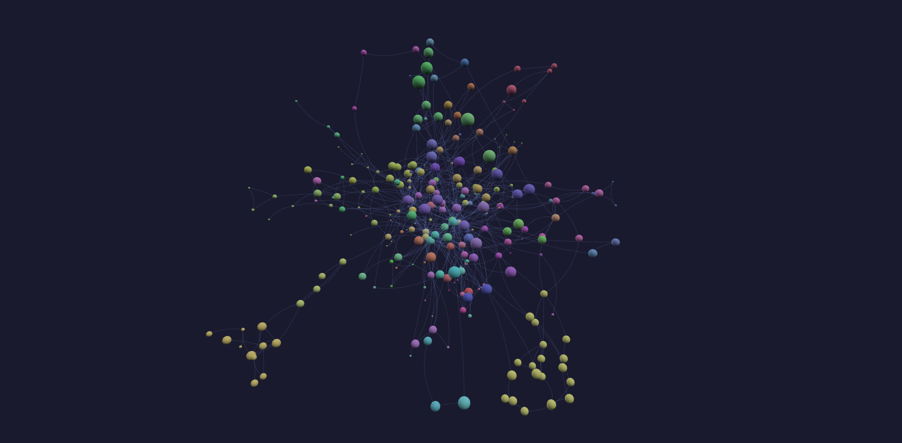
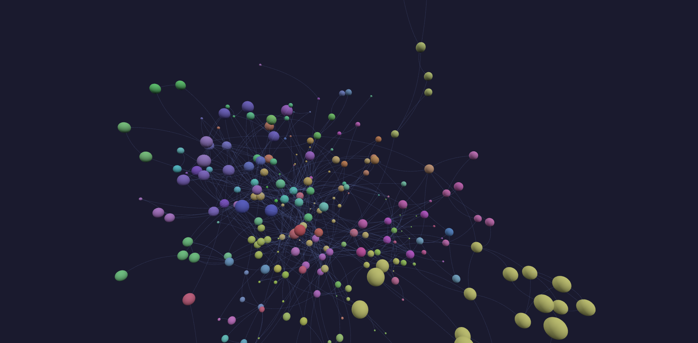
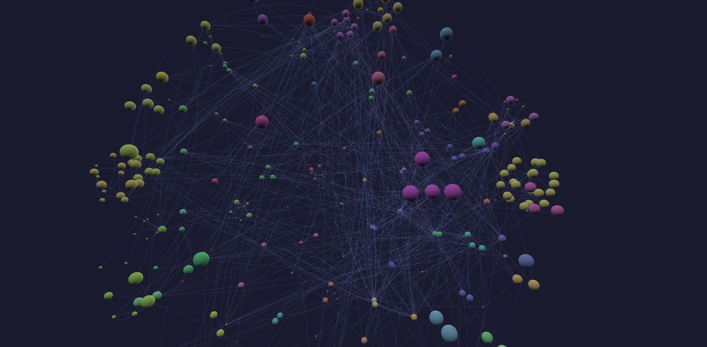
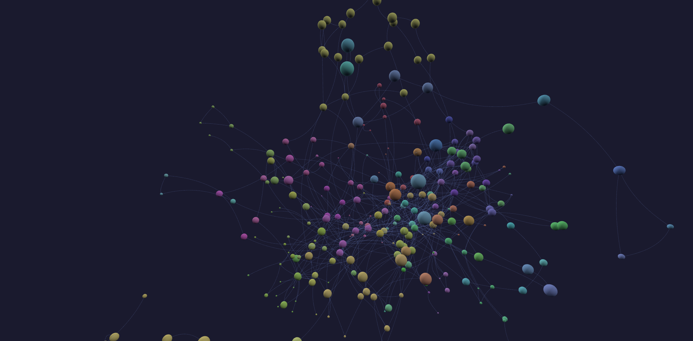
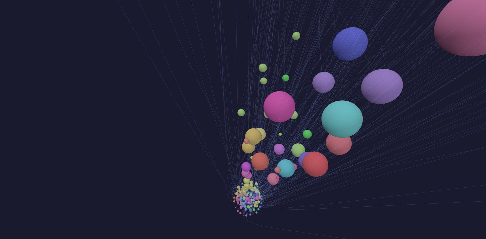
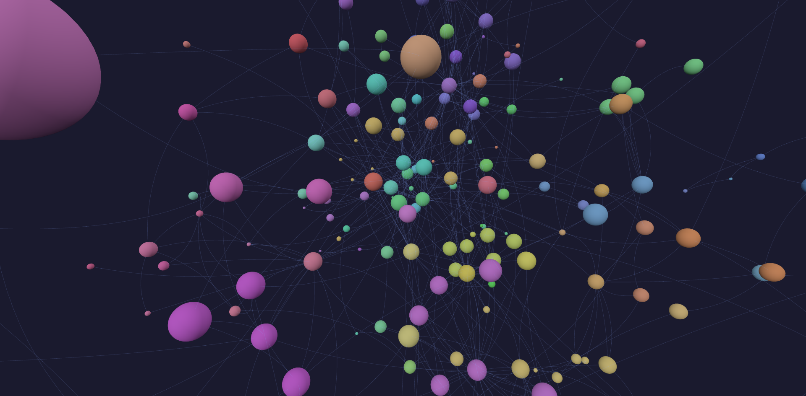
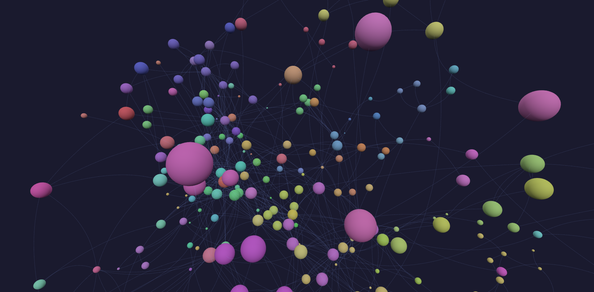
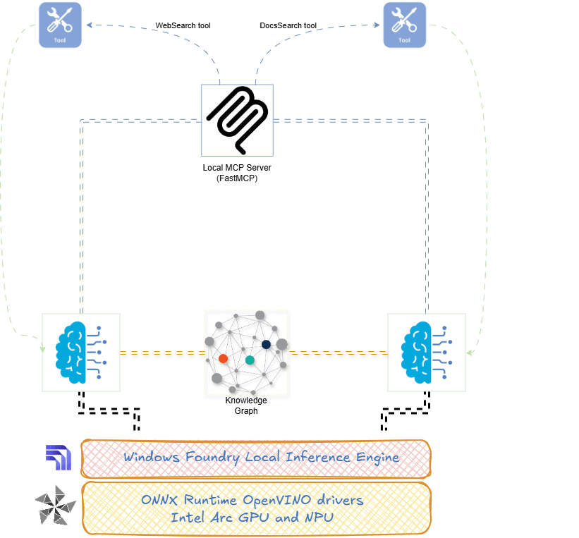

# Azure AI Graph Agent: An Agentic Enterprise Architecture Knowledge Graph

Build a continuously evolving Knowledge Graph of Azure AI, Machine Learning, Data, and Cloud Platform services using a multi-agent architecture powered by local LLMs and MCP tools.

## Overview

Azure AI Graph Agent is an experimental agentic system that automatically discovers, enriches, and visualizes relationships between Azure services, AI capabilities, machine learning components, and supporting platform infrastructure.

The project combines multiple specialized agents that collaborate through a local MCP (Model Context Protocol) server implemented with FastMCP.

The resulting Knowledge Graph can be explored through an interactive web visualization automatically generated and published through GitHub Actions.

## Screenshots
|  |  |  |
|----------------------------------|----------------------------------|----------------------------------|
|  |  |  |
|  |  |  |


## Architecture


## Agents

### 1. Azure Entity Agent

Responsible for discovering and maintaining graph nodes.

Examples:

* Azure AI Foundry
* Azure OpenAI
* Azure AI Search
* Azure Machine Learning
* Azure Kubernetes Service
* Azure Storage
* Azure Event Hub

Outputs:

```json
{
  "id": "az000123",
  "label": "Azure AI Foundry",
  "type": "service"
}
```

---

### 2. Dependency Agent

Responsible for discovering relationships among entities.

Examples:

* "Azure AI Foundry uses Azure AI Search"
* "Azure Machine Learning depends on Azure Storage"
* "Azure OpenAI integrates with Azure AI Foundry"

Outputs:

```json
{
  "source": "Azure AI Foundry",
  "target": "Azure AI Search",
   "to": [
      "az000145"
    ],
    "from": [],
    "category": "AI; Alignment",
}
```

---

### 3. Documentation Agent

Enriches graph entities with official Microsoft documentation.

Primary source:

* Microsoft Learn Search API
* https://learn.microsoft.com/api/search

Outputs:

```json
{
  "entity": "Azure AI Foundry",
  "docs": [
    {
      "title": "Azure AI Foundry Documentation",
      "url": "..."
    }
  ]
}
```

## MCP Integration

The agents communicate through a local FastMCP server.

Current MCP capabilities include:

* Web search
* Documentation search
* Knowledge graph updates
* Relationship discovery
* Machine Learning algorithms for network graph analysis

The architecture is intentionally modular so additional MCP tools can be added without changing agent implementations.

## Visualization

A GitHub Action automatically generates and deploys an interactive HTML/JavaScript visualization after each commit.

Features:

* Interactive graph exploration
* Force / Hierachical or Cluster visualization
* Service dependency navigation
* Documentation drill-down
* Continuous graph updates

## Current Status

This project is under active development. See the local SLM frying my NPU here:


The graph is continuously expanding as new:

* Azure services
* AI capabilities
* Documentation sources
* Relationship types
* MCP tools
* Agent workflows

are added.

Expect frequent schema updates and architectural evolution.

## Roadmap

### Knowledge Graph

* [ ] Complete Azure AI ecosystem coverage
* [ ] Azure Data platform coverage
* [ ] Azure Security coverage
* [ ] Azure Integration Services coverage

### Agents

* [ ] Relationship validation agent
* [ ] ML Graph analysis agent (Louvain/Leiden for communities, ensure Percolation to super-cluster for complete connectivity)
* [ ] Documents retrieval agent
* [ ] Graph enrichment agent

### AI

* [ ] Local SLM support (phi-4 SLM on OpenVino and Intel ARc GPU/NPU)
* [ ] Azure OpenAI support
* [ ] Multi-model evaluation (phi-4, qwen, deepseek)
* [ ] Champion-Challenger agent comparisons

### Graph Analytics

* [ ] Centrality metrics
* [ ] Dependency impact analysis
* [ ] Service ecosystem clustering
* [ ] Missing-edge discovery

## Example Use Cases

* Azure architecture discovery
* AI platform dependency analysis
* Documentation navigation
* Cloud capability mapping
* Certification preparation
* Enterprise architecture analysis
* Knowledge graph experimentation
* Agentic AI research

## Technologies

* Python
* FastMCP
* Azure AI Foundry Local
* Local LLMs / SLMs (Microsoft Foundry Local with OpenVINO and WinML support for Intel ARc GPU/NPU)
* NetworkX
* GitHub Actions
* JavaScript Visualization
* Microsoft Learn Search API


## License

Released under the MIT License.

## Acknowledgements

Special thanks to Microsoft and The Palindrome for their tools, documentation, samples, and contributions to the AI and cloud ecosystem that inspired this project.

## Disclaimer

This project is an independent personal initiative created for research, learning, and experimentation purposes.

The knowledge graph is continuously evolving and is not intended to be complete, exhaustive, or authoritative. Information, relationships, and documentation mappings may be incomplete, inaccurate, or subject to change.

This project is not affiliated with, endorsed by, sponsored by, or associated with Microsoft.

The views, opinions, code, and content expressed in this repository are solely those of the author and do not represent the views, positions, or policies of any current or former employer.

**Use at your own discretion; always verify information against official documentation before making architectural, operational, or business decisions**
